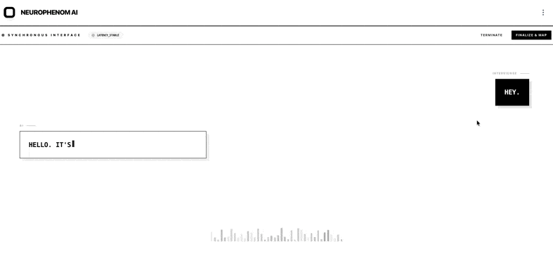
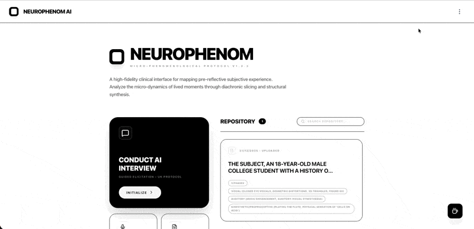
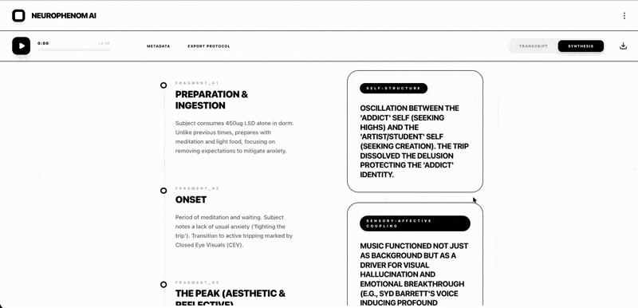

<div align="center">

# 🧠 NeuroPhenom AI


🎚️ High-Fidelity Clinical Interface for Neurophenomenology


<br>



꩜ Mapping pre-reflective subjective experience through granular interview techniques

<br>



📝 Use the trained AI research interviewer or record and transcribe

<br>




🧩 AI analyses and codifies each interview

<br>`

[](LICENSE)

</div>

---

## About

High-fidelity clinical interface for mapping pre-reflective subjective experience. The conversational AI is trained in granular microphenomenology interview techniques, on altered states of consciousness in particular. Codify and theme your subject data alongside NeuroPhenom AI's granular LLM engine. Analyse the micro-dynamics of lived moments through diachronic slicing and structural synthesis.

Featuring a stark black-and-white minimalist design, the interface stays out of the way and lets the phenomenological work take centre stage.

## Requirements

Add Google Gemini API key in settings menu. Best performance in Chrome browser.

## Features

- 🎙️ **Live Interview Sessions** — AI-guided microphenomenology interviews in real time
- 🎤 **Standalone Recorder** — Capture audio independently of the interview system
- 📊 **Analysis View** — Review and codify interview data with AI assistance
- 🔬 **Diachronic Slicing** — Temporal decomposition of experiential moments
- 🧩 **Structural Synthesis** — Map the architecture of subjective states
- ✅ **Consent Protocols** — Built-in consent management for ethical research practice
- 💾 **Local Storage** — Interviews saved locally for data sovereignty
- ⚙️ **Configurable** — Language, voice gender, and interview mode settings
- 🖤 **Minimalist Design** — Clean black/white aesthetic focused on the work

## Tech Stack

| Layer | Technology |
|-------|-----------|
| Frontend | React + TypeScript, Vite |
| AI | Google Gemini API |
| Design | Minimalist black/white UI |
| Deployment | Docker / Google Cloud |

## Installation

```bash
# Clone the repository
git clone https://github.com/chaosste/NeuroPhenomAI.git
cd NeuroPhenomAI

# Install dependencies
npm install

# Configure your Gemini API key

# Run development server
npm run dev
```

## Workflow Protocol

Use the worktree/branch protocol in:
- `docs/WORKTREE_WORKFLOW_PROTOCOL.md`

Operational canon:
- <https://github.com/chaosste/ops-playbooks>

## Related Projects

> 💡 **Like NeuroPhenom AI? You'll love [MicroPhenom AI](https://github.com/chaosste/MicroPhenom-AI)** — the vanilla edition for granular reports on wider lived experience.

> 𓂀 For psychedelic trip report interviews with theatrical deity-themed voices, see [Anubis](https://github.com/chaosste/Anubis).

## Disclaimer

NeuroPhenom AI is a research tool for exploring subjective experience. It does not provide medical, psychological, or therapeutic advice. It is not a substitute for professional support.

---

<div align="center">

**Built by [Steve Beale](https://newpsychonaut.com)**

[newpsychonaut.com](https://newpsychonaut.com)

© 2026 Stephen Beale. MIT License.

</div>
